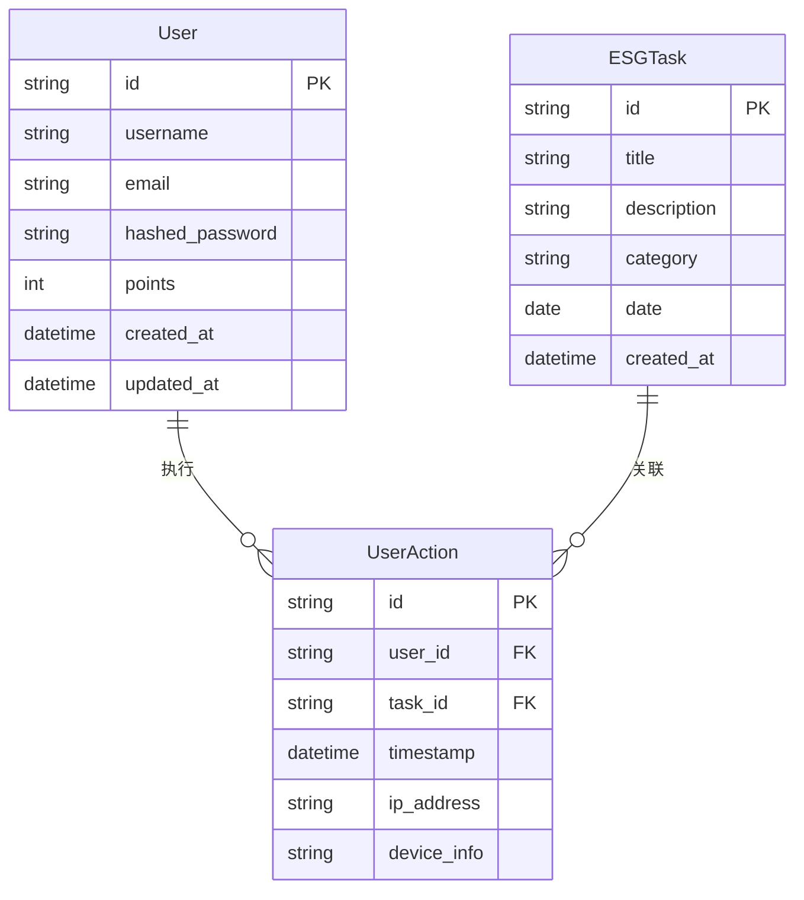

# 蔚澜智越 MVP 数据库设计

## ER图

以下是系统核心实体及其关系的实体关系图：

## 数据表详细设计

### users 表

存储用户信息和积分数据。

| 字段名 | 类型 | 约束 | 描述 |
|-------|------|------|------|
| id | VARCHAR(36) | PRIMARY KEY | 用户唯一标识，UUID格式 |
| username | VARCHAR(50) | NOT NULL | 用户名 |
| email | VARCHAR(100) | NOT NULL, UNIQUE | 电子邮箱，用于登录 |
| hashed_password | VARCHAR(100) | NOT NULL | 经过哈希处理的密码 |
| points | INTEGER | NOT NULL, DEFAULT 0 | 用户累计积分 |
| created_at | TIMESTAMP | NOT NULL, DEFAULT CURRENT_TIMESTAMP | 创建时间 |
| updated_at | TIMESTAMP | NOT NULL, DEFAULT CURRENT_TIMESTAMP | 更新时间 |

索引：
- `idx_users_email`：电子邮箱索引，用于加速登录查询

### esg_tasks 表

存储ESG任务信息。

| 字段名 | 类型 | 约束 | 描述 |
|-------|------|------|------|
| id | VARCHAR(36) | PRIMARY KEY | 任务唯一标识，UUID格式 |
| title | VARCHAR(100) | NOT NULL | 任务标题 |
| description | TEXT | NOT NULL | 任务详细描述 |
| category | VARCHAR(20) | NOT NULL | 任务分类（environment/society/governance） |
| date | DATE | NOT NULL | 任务日期 |
| created_at | TIMESTAMP | NOT NULL, DEFAULT CURRENT_TIMESTAMP | 创建时间 |

索引：
- `idx_tasks_date_category`：日期和分类的组合索引，用于加速筛选查询

### user_actions 表

存储用户的任务打卡记录。

| 字段名 | 类型 | 约束 | 描述 |
|-------|------|------|------|
| id | VARCHAR(36) | PRIMARY KEY | 行为记录唯一标识，UUID格式 |
| user_id | VARCHAR(36) | NOT NULL, FOREIGN KEY | 用户ID，关联users表 |
| task_id | VARCHAR(36) | NOT NULL, FOREIGN KEY | 任务ID，关联esg_tasks表 |
| timestamp | TIMESTAMP | NOT NULL, DEFAULT CURRENT_TIMESTAMP | 打卡时间戳 |
| ip_address | VARCHAR(45) | NULL | 用户IP地址 |
| device_info | VARCHAR(255) | NULL | 设备信息 |

索引：
- `idx_actions_user_id`：用户ID索引，用于加速查询用户的打卡记录
- `idx_actions_task_id`：任务ID索引，用于加速查询任务的打卡记录
- `idx_actions_timestamp`：时间戳索引，用于加速时间范围查询
- `uq_actions_user_task_date`：用户ID、任务ID和日期的唯一约束，防止重复打卡

## 数据关系说明

1. **用户与行为记录**：一对多关系，一个用户可以有多条行为记录。
   - 外键约束：`user_actions.user_id` 引用 `users.id`
   - 删除规则：CASCADE（当用户被删除时，相关的行为记录也会被删除）

2. **任务与行为记录**：一对多关系，一个任务可以有多条行为记录。
   - 外键约束：`user_actions.task_id` 引用 `esg_tasks.id`
   - 删除规则：RESTRICT（防止删除已有行为记录的任务）

## 数据完整性约束

1. **实体完整性**：
   - 所有表都有主键约束，确保每条记录的唯一性
   - 用户电子邮箱有唯一约束，防止重复注册

2. **参照完整性**：
   - 外键约束确保行为记录关联到有效的用户和任务
   - 级联删除规则保证数据一致性

3. **域完整性**：
   - 非空约束确保必要字段有值
   - 默认值设置，如新用户的初始积分为0

## 查询优化考虑

1. **常用查询模式**：
   - 用户登录：通过email查询用户信息
   - 任务列表：按日期和分类筛选任务
   - 用户打卡：检查用户是否已完成特定任务
   - 积分统计：统计用户的总积分和完成任务数

2. **索引策略**：
   - 为常用查询条件创建索引
   - 为外键创建索引加速关联查询
   - 为排序和分组操作的字段创建索引

## 数据迁移策略

使用Alembic进行数据库迁移管理，支持以下操作：

1. **版本控制**：记录数据库结构的每次变更
2. **向前迁移**：应用新的数据库变更
3. **向后迁移**：回滚到之前的数据库结构
4. **生成迁移脚本**：自动检测模型变化并生成迁移脚本 