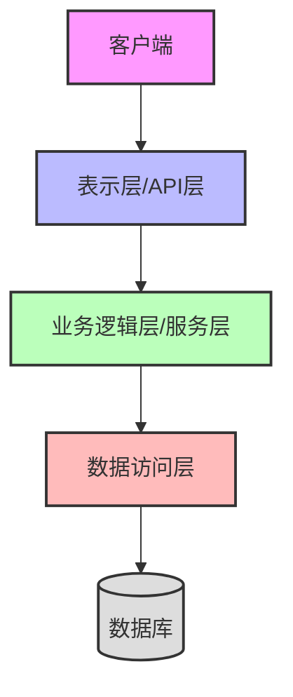
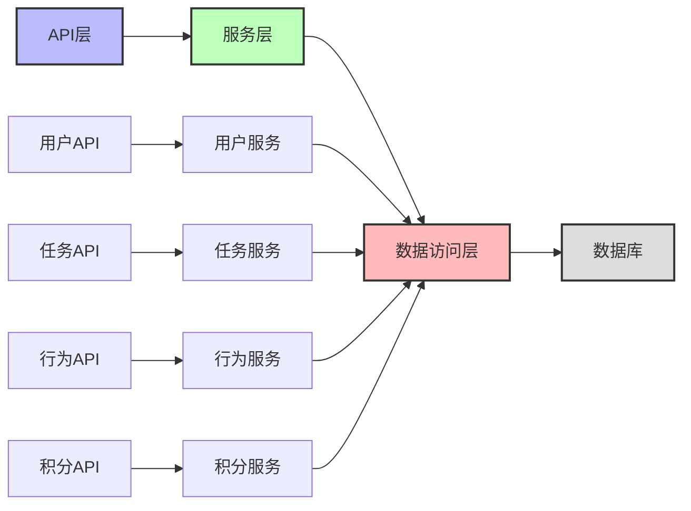
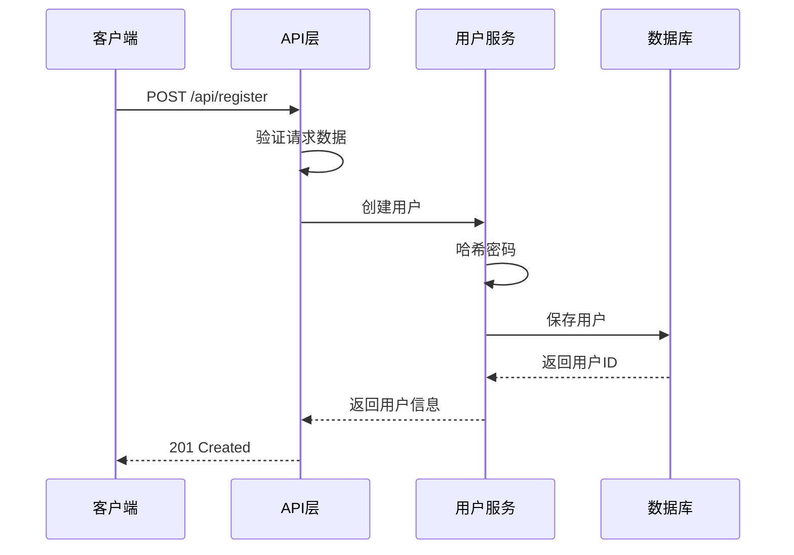
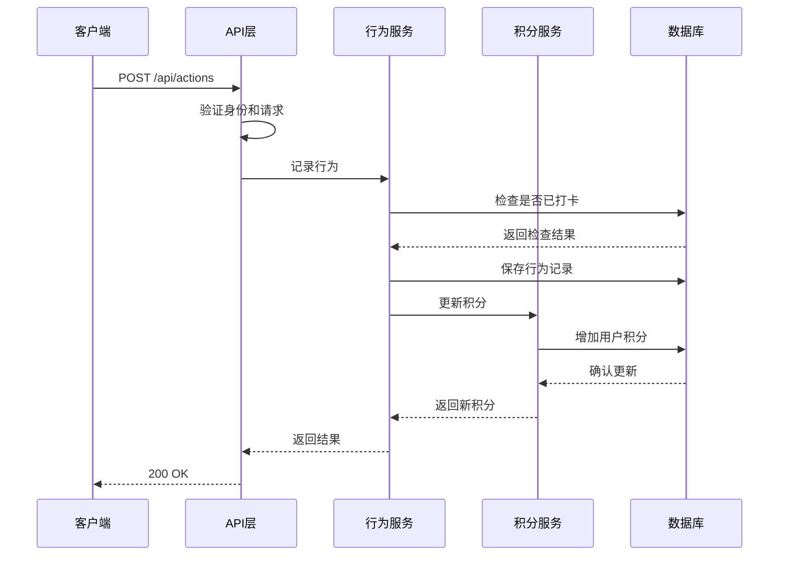

# 蔚澜智越 MVP 系统架构设计

## 整体架构

蔚澜智越 MVP 采用经典的三层架构：表示层、业务逻辑层和数据访问层。

## 组件详情

### 表示层（API层）
- **技术选择**：FastAPI
- **主要职责**：
  - 处理HTTP请求和响应
  - 路由管理
  - 请求验证
  - 响应序列化
  - 身份认证和授权
- **组件**：
  - 路由模块（user.py, task.py, action.py）
  - 中间件（认证、错误处理、日志）
  - Pydantic模型（请求/响应架构）

### 业务逻辑层（服务层）
- **技术选择**：Python模块
- **主要职责**：
  - 实现核心业务逻辑
  - 协调数据访问
  - 处理事务和一致性
  - 执行业务规则验证
- **组件**：
  - 用户服务（用户注册、登录、管理）
  - 任务服务（任务管理和查询）
  - 行为记录服务（打卡记录和验证）
  - 积分服务（积分计算和管理）
  - 仪表盘服务（数据统计和分析）

### 数据访问层
- **技术选择**：SQLModel (SQLAlchemy + Pydantic)
- **主要职责**：
  - 数据库操作抽象
  - CRUD操作实现
  - 查询构建
  - 事务管理
- **组件**：
  - 数据模型（User, ESGTask, UserAction）
  - 数据库会话管理
  - 查询工具函数

### 数据存储
- **技术选择**：SQLite (开发) / PostgreSQL (生产)
- **主要职责**：
  - 持久化存储应用数据
  - 提供数据查询能力
  - 维护数据完整性和一致性
- **组件**：
  - 关系型数据库表
  - 索引和约束

## 模块依赖关系

## 数据流程

以下是系统中的核心数据流程：

### 用户注册流程

### 任务打卡流程

## 安全设计

### 认证与授权
- 使用JWT（JSON Web Tokens）进行身份认证
- 基于角色的访问控制（RBAC）
- 令牌过期机制

### 数据安全
- 密码哈希存储（使用bcrypt）
- 输入验证和清洗
- 参数化SQL查询（防止SQL注入）

### API安全
- CORS（跨域资源共享）策略
- 速率限制
- HTTPS传输加密

## 扩展性考虑

系统设计时考虑了以下扩展性因素：

- **模块化架构**：每个功能模块独立封装，便于扩展和维护
- **依赖注入**：通过依赖注入减少组件间耦合
- **配置外部化**：通过环境变量和配置文件控制系统行为
- **数据库抽象**：通过ORM抽象数据访问，支持多种数据库后端
- **API版本控制**：为未来API变更提供版本控制能力 