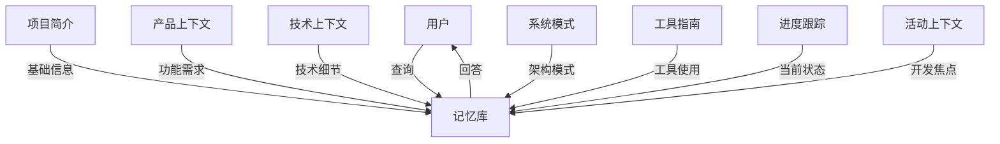
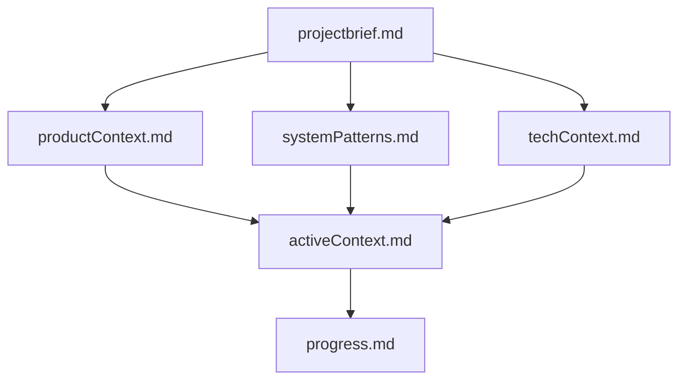
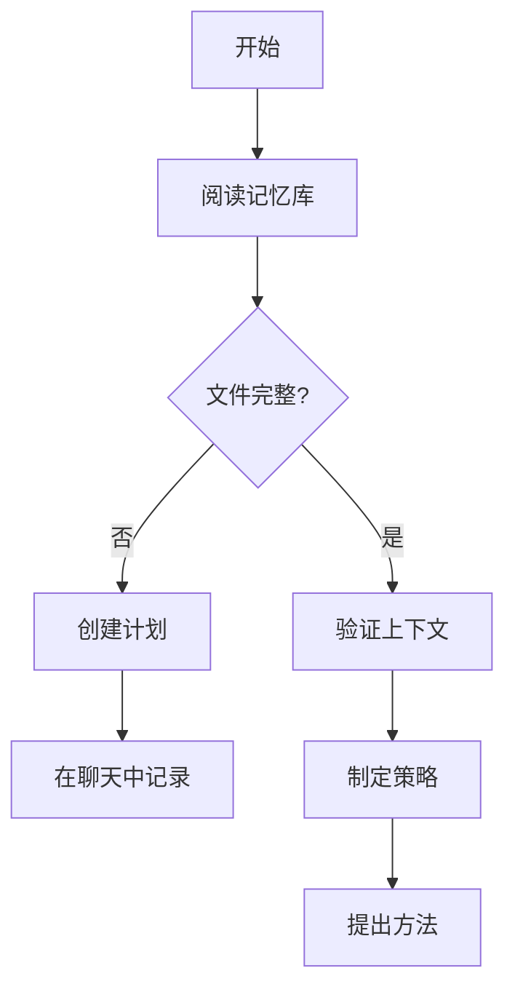
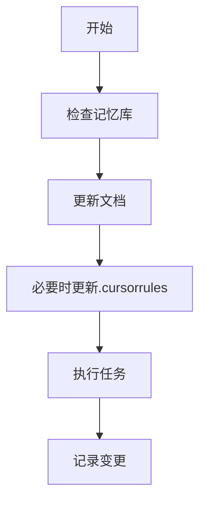
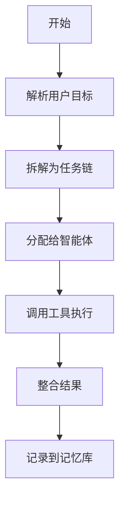
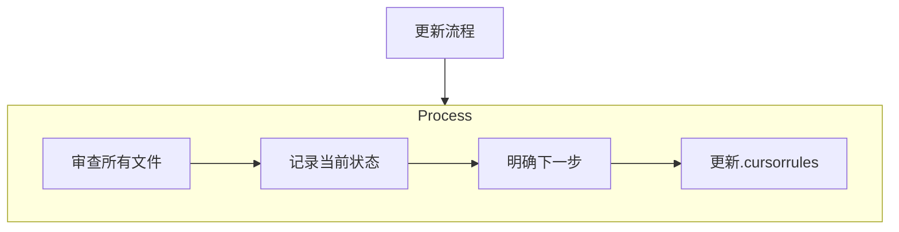
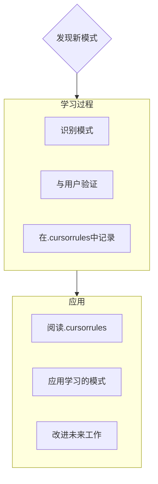

# 蔚澜智越记忆库

蔚澜智越记忆库是项目知识和进展的中央存储位置。记忆库包含以下几个关键文档：

## 项目概述

- [项目简介](./projectbrief.md) - 项目愿景、范围、目标用户和关键指标
- [产品上下文](./productContext.md) - 产品定位、用户故事、关键功能和竞品分析
- [技术上下文](./techContext.md) - 技术栈、开发环境、技术约束和LLM模型选型
- [系统模式](./systemPatterns.md) - 系统架构、智能体编排模式、数据流和设计模式
- [工具指南](./toolsGuide.md) - LLM API工具、网页抓取、搜索引擎和自我进化系统

## 项目状态

- [进度跟踪](./progress.md) - 当前阶段、已完成任务、经验教训和下一步计划
- [活动上下文](./activeContext.md) - 当前迭代焦点、开发中功能和已知问题

## 使用指南

### 添加新知识

当你获得新的项目知识时：

1. 确定适合的文档类别
2. 更新相关文档，保持一致的格式
3. 在必要时创建新的文档，并在memorybank.md中添加引用
4. 对于重大更新，同时更新进度跟踪文档

### 检索知识

根据需求检索不同类型的知识：

- 需要了解项目整体情况 → 项目简介
- 需要技术细节和实现指南 → 技术上下文
- 需要了解系统架构和模式 → 系统模式
- 需要工具使用方法 → 工具指南
- 需要了解当前进展 → 进度跟踪
- 需要当前开发焦点 → 活动上下文

## 最近更新

- 2023-10-15: 添加工具指南，更新技术上下文和系统模式
- 2023-10-10: 更新进度跟踪，添加新的经验教训
- 2023-10-05: 创建记忆库初始结构
- 2023-10-01: 创建项目简介文档

## 数据流图



## 记忆库组成

```
memory_bank/
├── activeContext.md   # 当前活动上下文和工作重点
├── memorybank.md      # 记忆库索引(本文件)
├── productContext.md  # 产品背景与需求上下文
├── progress.md        # 项目进度与里程碑
├── projectbrief.md    # 项目简介与总体目标
├── systemPatterns.md  # 系统设计模式与原则
└── techContext.md     # 技术上下文与决策记录
```

## 记忆库更新日志

- 2023-12-15: 初始化记忆库结构
- 2023-12-20: 添加项目简介和产品上下文
- 2024-01-05: 完善技术上下文和系统模式
- 2024-01-15: 更新项目进度和活动上下文
- 2024-01-25: 技术栈选型确认记录
- 2024-02-10: 添加五层架构体系定义
- 2024-04-30: 更新项目进度，增加已完成的初始化工作
- 2024-04-30: 更新活动上下文，反映当前状态和下一步计划

## 项目状态摘要

- **当前阶段**: 基础架构搭建与核心模块开发
- **完成度**: ~25%
- **优先任务**: 知识层与规划层实现
- **关键挑战**: 大规模知识管理与智能体协作

## 关键决策记录

1. **系统架构**: 采用五层体系架构，分离关注点
   - 决策日期: 2024-01-10
   - 状态: 已确认
   - 理由: 提高模块化程度，便于扩展和维护

2. **技术栈选型**:
   - 前端: Next.js + TailwindCSS + TypeScript
   - 后端: FastAPI + PostgreSQL + Neo4j + Weaviate/Qdrant
   - AI: OpenAI API + Claude + LangGraph/Autogen/CrewAI
   - 决策日期: 2024-01-25
   - 状态: 已确认
   - 理由: 平衡开发效率、性能与可维护性

3. **产品定位**:
   - 面向企业的智能操作系统，提供决策支持与流程自动化
   - 决策日期: 2023-12-20
   - 状态: 已确认
   - 理由: 企业市场需求明确，价值主张清晰

4. **编码规范**:
   - 前端: React函数组件，模块化CSS，TypeScript强类型
   - 后端: FastAPI路由器，依赖注入，Pydantic模型
   - 决策日期: 2024-04-30
   - 状态: 已确认
   - 理由: 确保代码一致性与可维护性

## 当前问题与风险

1. **性能挑战**:
   - 大规模向量检索性能优化
   - 多模态输入处理效率
   - 缓解措施: 分层缓存策略，批量处理

2. **集成复杂性**:
   - 多种数据库协同工作
   - 多个AI服务集成
   - 缓解措施: 抽象接口层，适配器模式

3. **智能体可靠性**:
   - 复杂任务下的稳定性
   - 错误恢复机制
   - 缓解措施: 多级监控与回退策略

## 参考资源

- [系统设计文档](../architecture/01_system_design_document.md)
- [API设计规范](../api/02_api_design_specification.md)
- [编码规范](../guides/04_coding_standards.md)
- [开发环境设置](../guides/03_development_environment_setup.md)

## 使用指南

记忆库文件应在以下情况更新:
1. 重要决策达成一致
2. 核心功能实现完成
3. 技术方向发生变更
4. 项目里程碑达成
5. 发现重大问题或风险

每次更新应包含日期、变更内容和理由，保持记忆库的完整性和时效性。

## 记忆库结构

记忆库由必需的核心文件和可选的上下文文件组成，全部采用Markdown格式。文件在清晰的层次结构中相互构建：



### 核心文件（必需）
1. `projectbrief.md`
   - 塑造所有其他文件的基础文档
   - 如果不存在，在项目开始时创建
   - 定义核心需求和目标
   - 项目范围的真实来源

2. `productContext.md`
   - 此项目存在的原因
   - 解决的问题
   - 应该如何工作
   - 用户体验目标
   - 五大核心模块：蔚澜策、蔚澜行、蔚澜源、蔚澜境、蔚澜鉴

3. `activeContext.md`
   - 当前工作重点
   - 最近的变更
   - 下一步
   - 活跃的决策和考虑因素

4. `systemPatterns.md`
   - 系统架构
   - 关键技术决策
   - 使用中的设计模式
   - 组件关系
   - 智能体编排流程

5. `techContext.md`
   - 使用的技术
   - 开发设置
   - 技术约束
   - 依赖关系
   - LLM引擎、Agent编排、知识系统选型

6. `progress.md`
   - 已完成的功能
   - 待构建的内容
   - 当前状态
   - 已知问题
   - 版本里程碑跟踪

### 附加上下文
当有助于组织以下内容时，在memory-bank/中创建其他文件/文件夹：
- 复杂功能文档
- 集成规范
- API文档
- 测试策略
- 部署程序
- 蔚澜智越子模块文档

## 核心工作流程

### 规划模式


### 执行模式


### 智能体编排流程


## 文档更新

记忆库更新发生在：
1. 发现新的项目模式时
2. 实现重大变更后
3. 当用户使用**更新记忆库**请求时（必须审查所有文件）
4. 当需要澄清上下文时



注意：当由**更新记忆库**触发时，我必须审查每个记忆库文件，即使有些不需要更新。特别关注activeContext.md和progress.md，因为它们跟踪当前状态。

## 项目智能（.cursorrules）

.cursorrules文件是我为每个项目维护的学习日志。它捕获重要的模式、偏好和项目情报，帮助我更有效地工作。当我与您和项目合作时，我会发现并记录从代码中不明显的关键见解。



### 要捕获的内容
- 关键实现路径
- 用户偏好和工作流程
- 项目特定模式
- 已知挑战
- 项目决策的演变
- 工具使用模式
- 蔚澜智越特定术语和命名约定

格式是灵活的 - 重点是捕获有价值的见解，帮助我与您和项目更有效地合作。将.cursorrules视为一个随着我们一起工作而变得更智能的活文档。

记住：每次记忆重置后，我完全重新开始。记忆库是我与之前工作的唯一联系。它必须以精确和清晰来维护，因为我的效率完全取决于其准确性。 