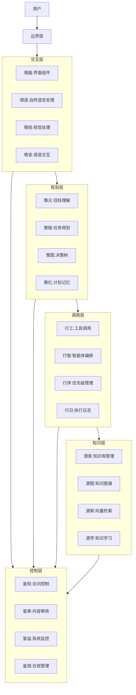
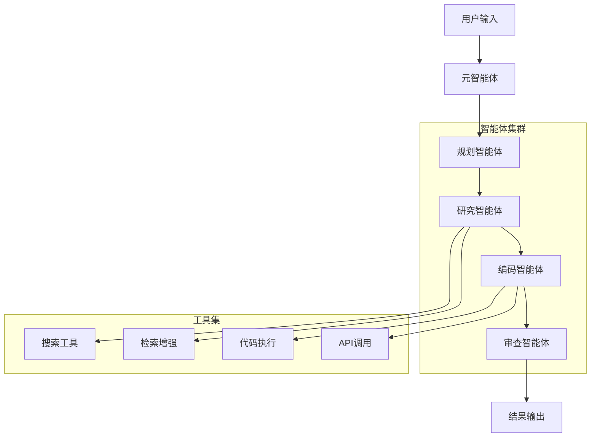
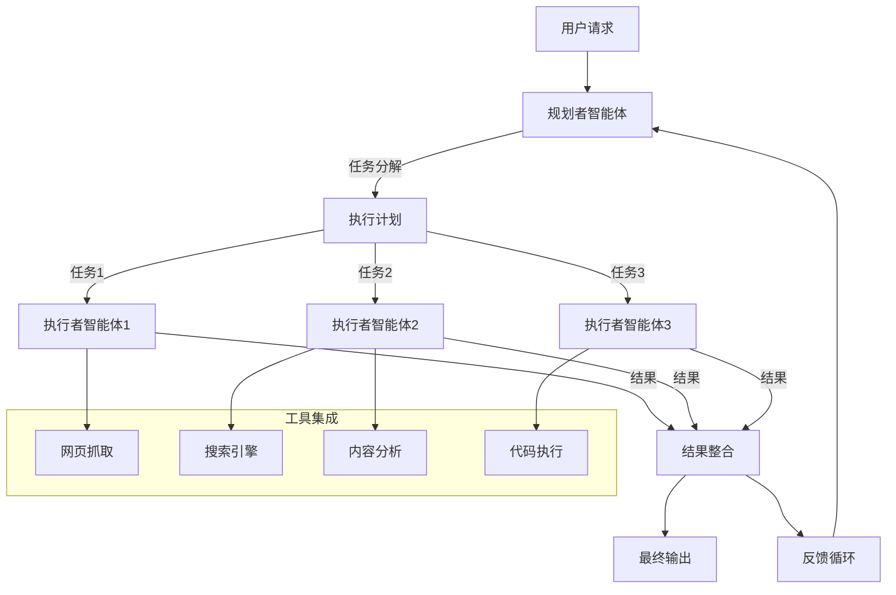
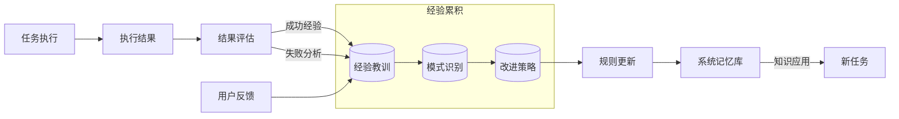
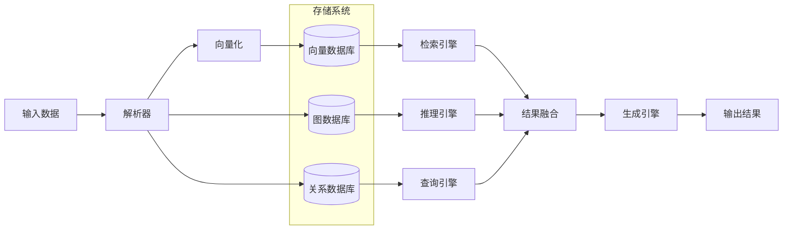

# 系统模式与架构

## 系统架构

## 智能体编排模式

## 规划者-执行者模式

## 自我进化模式

## 数据流模式

## 关键技术决策

1. **智能体编排框架**：采用基于有向无环图(DAG)的任务流编排，支持并行执行与条件分支
2. **向量检索策略**：使用混合检索(Hybrid Search)结合关键词与语义搜索
3. **知识图谱构建**：采用半自动化方式，结合规则提取与人工验证
4. **安全控制模型**：实现基于RBAC与ABAC的多层次权限控制
5. **多模态处理**：采用统一嵌入模型处理不同模态输入，实现跨模态检索
6. **自我进化机制**：实现基于用户反馈和执行结果的系统自适应学习
7. **工具自动选择**：基于任务特性智能选择最适合的外部工具和API

## 设计模式应用

1. **策略模式**：用于不同检索策略的实现与切换
2. **观察者模式**：用于系统事件处理与监控
3. **工厂模式**：用于智能体创建与配置
4. **适配器模式**：用于不同AI模型的统一接口
5. **装饰器模式**：用于工具功能的动态扩展
6. **命令模式**：用于工具调用的封装与执行
7. **模板方法模式**：用于智能体行为的标准化处理 