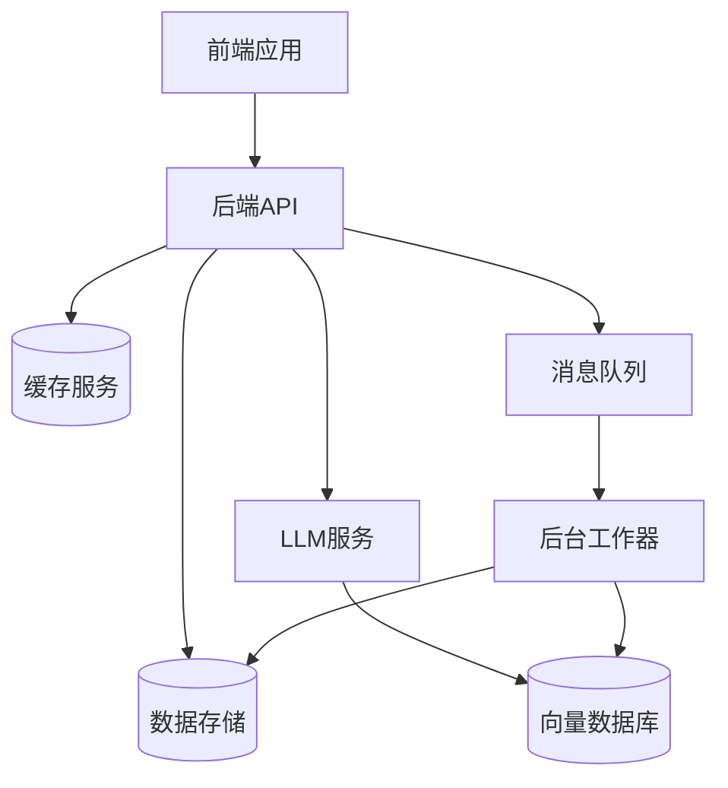

# 技术上下文

## 开发技术栈

### 前端技术
- **框架**：Next.js 14.0+
- **样式**：TailwindCSS
- **状态管理**：Zustand
- **图表可视化**：Mermaid.js
- **UI组件**：shadcn/ui
- **类型系统**：TypeScript 5.0+

### 后端技术
- **API框架**：FastAPI
- **关系数据库**：PostgreSQL 16
- **图数据库**：Neo4j
- **向量数据库**：Weaviate/Qdrant
- **缓存系统**：Redis
- **消息队列**：RabbitMQ

### AI与智能体
- **LLM引擎**：OpenAI API (GPT-4o), Claude 3
- **智能体编排**：LangGraph, Autogen, CrewAI
- **向量检索**：FAISS, Milvus
- **嵌入模型**：OpenAI Ada, BGE Embedding
- **知识抽取**：LangChain

### 部署与运维
- **容器化**：Docker
- **编排**：Kubernetes
- **CI/CD**：GitHub Actions
- **监控**：Prometheus + Grafana
- **日志**：ELK Stack

## 开发环境设置

### 本地开发
```bash
# 前端开发
cd frontend
npm install
npm run dev

# 后端开发
cd backend
python -m venv venv
source venv/bin/activate  # 或 Windows 上的 venv\Scripts\activate
pip install -r requirements.txt
uvicorn app.main:app --reload
```

### 配置管理
- 使用`.env`文件管理环境变量
- 使用`config-{env}.yaml`管理各环境配置
- 敏感配置使用Kubernetes Secrets存储

## 技术约束

1. **API响应时间**：REST API端点响应时间应小于500ms
2. **向量检索延迟**：向量检索操作应在200ms内完成
3. **并发处理能力**：系统应支持至少100个并发用户请求
4. **LLM令牌限制**：系统提示词不应超过2000个令牌
5. **移动兼容性**：UI必须支持响应式设计，适配移动设备

## 依赖关系

### 外部依赖
- OpenAI API / Azure OpenAI
- Claude API
- 企业内部API系统
- 外部知识库连接器

### 内部依赖


## LLM模型选型

| 用途 | 推荐模型 | 替代选项 |
|------|----------|----------|
| 主要对话 | GPT-4o | Claude 3 Opus |
| 内容生成 | Claude 3 Sonnet | GPT-3.5 Turbo |
| 代码生成 | Claude 3 Opus | GPT-4o |
| 文本嵌入 | OpenAI Ada 002 | BGE Large |
| 多模态处理 | GPT-4o | Claude 3 Opus |

## LLM工具集成

### 多模型支持
- 支持OpenAI、Anthropic Claude、Azure OpenAI和Google Gemini等多种模型
- 提供统一的API接口，便于切换不同提供商的模型
- 基于环境配置自动选择最佳模型

### 环境配置优先级
```
1. 系统环境变量
2. .env.local（用户特定覆盖）
3. .env（项目默认值）
4. .env.example（示例配置）
```

### LLM调用最佳实践
- 使用模型特定图像处理能力（如GPT-4o替代旧版模型）
- 处理国际化内容时注意UTF-8编码问题
- 调试信息输出到stderr，保持stdout输出干净
- 使用自适应提示工程提高模型响应质量

### 工具使用技巧
- 多模态分析：整合文本、图像和代码分析
- 搜索引擎查询：获取实时信息并过滤噪声
- 网页抓取：支持复杂网页解析和内容提取
- 自动截图验证：用于UI测试和结果验证 