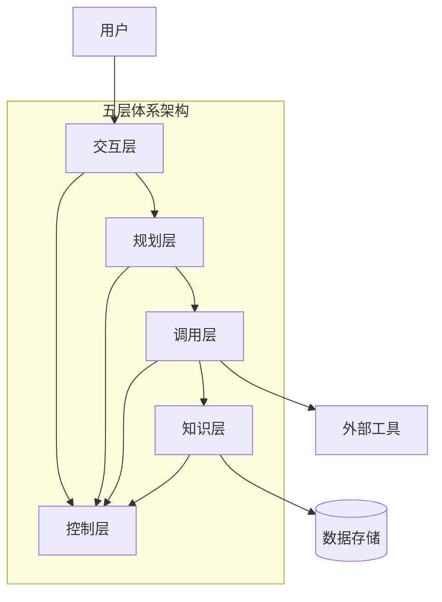
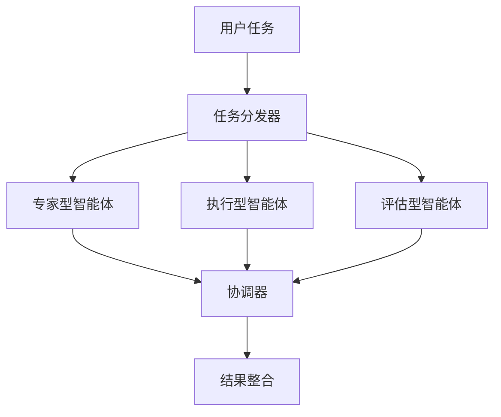
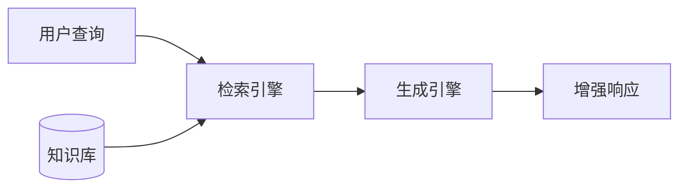
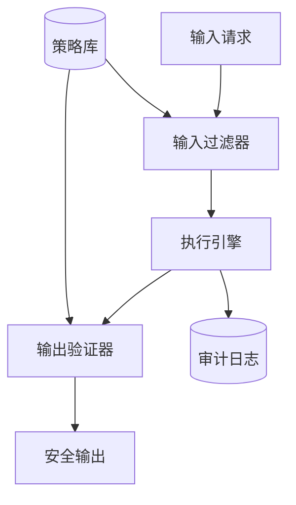
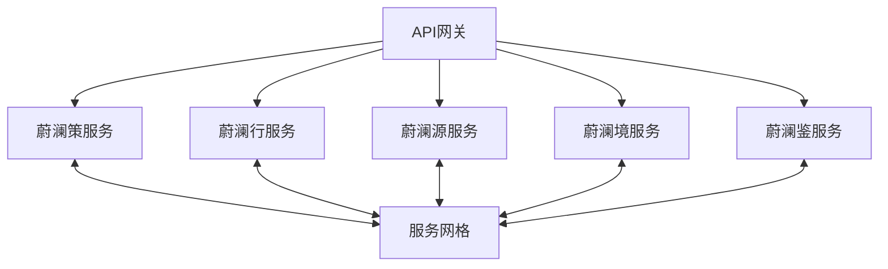
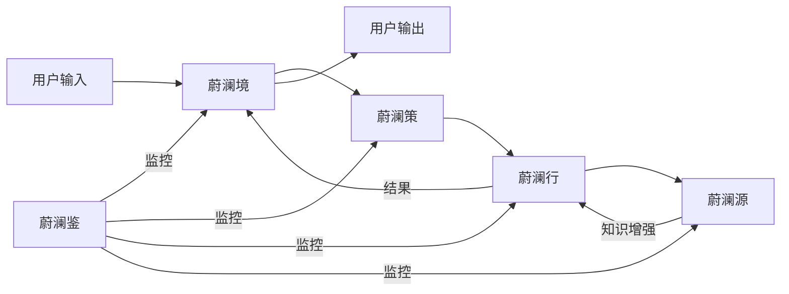

# 蔚澜智越系统模式

## 五层架构体系

蔚澜智越采用独特的五层体系架构，各层职责清晰分离，协同工作：

### 核心层级定义

- **蔚澜策**：规划层 - 负责规划与目标分解
  - 子模块：策元(目标理解)、策链(任务规划)、策图(决策树)、策忆(计划记忆)
  - 职责：理解用户意图，分解复杂任务，制定执行计划

- **蔚澜行**：调用层 - 负责任务调度与工具调用
  - 子模块：行工(工具调用)、行智(智能体调度)、行序(任务优先级)、行日(执行日志)
  - 职责：协调多智能体协作，执行工具调用，监控任务状态

- **蔚澜源**：知识层 - 负责企业知识和向量存储
  - 子模块：源库(知识库管理)、源图(知识图谱)、源索(向量检索)、源学(知识学习)
  - 职责：管理企业知识，提供向量检索，维护知识图谱

- **蔚澜境**：交互层 - 负责多模态交互界面
  - 子模块：境面(用户界面)、境语(语言处理)、境视(视觉处理)、境音(语音交互)
  - 职责：处理用户输入输出，呈现多模态内容，提供一致交互体验

- **蔚澜鉴**：控制层 - 负责安全与合规
  - 子模块：鉴权(访问控制)、鉴审(内容审核)、鉴监(系统监控)、鉴规(合规管理)
  - 职责：确保系统安全，控制数据访问，监控系统行为

## 核心设计模式

### 1. 智能体编排模式

- **Meta-Agent模式**：核心调度智能体协调多个专业智能体
- **Team Collaboration模式**：智能体团队协作完成复杂任务
- **Pipeline模式**：任务在多个智能体间按顺序流转处理

### 2. 知识增强模式

- **分块与嵌入**：将知识分块并生成向量嵌入
- **混合检索策略**：结合关键词和语义向量的混合检索
- **多源知识整合**：整合结构化与非结构化知识来源

### 3. 安全与合规模式

- **多层防护**：输入过滤、运行时监控、输出验证
- **RBAC权限模型**：基于角色的访问控制
- **行为审计**：全流程操作记录和审计追踪

### 4. 微服务架构模式

- **服务独立部署**：每个核心层可独立部署和扩展
- **容器化**：所有服务使用Docker容器化部署
- **API驱动**：层间通过标准化API接口通信

## 数据流模式

- **单向数据流**：请求从交互层流向知识层，响应反向流动
- **实时流处理**：支持流式请求和响应
- **异步处理**：长时间任务采用异步处理模式

## 扩展性设计

- **模块化插件系统**：各层支持插件扩展
- **工具注册机制**：自定义工具可动态注册到调用层
- **知识源适配器**：支持多种数据源集成到知识层
- **多LLM提供商**：支持多种LLM服务，可动态切换或组合 